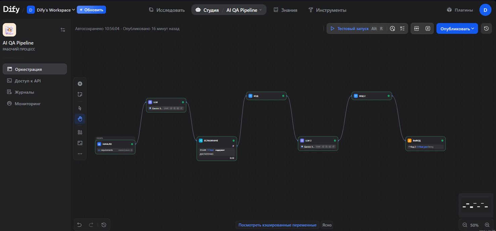

# 🤖 Dify QA Pipeline

[](https://udify.app/chat/qBItfkx2ToZ38pUX)
[](LICENSE)
[](https://www.python.org/)

AI-пайплайн для автоматической генерации тест-кейсов на основе требований. Построен на платформе Dify с использованием LLM (Gemini/GPT/Claude).

---

## 🌐 Онлайн-демо

**Попробовать прямо сейчас (без установки):** [https://udify.app/chat/qBItfkx2ToZ38pUX](https://udify.app/chat/qBItfkx2ToZ38pUX)

[](https://udify.app/chat/qBItfkx2ToZ38pUX)

---

## 📋 Что делает пайплайн

| Этап | Описание |
|:----:|----------|
| 1 | Проверяет, достаточно ли информации в требованиях |
| 2 | Маскирует чувствительные данные (email, телефон, пароль) |
| 3 | Генерирует тест-кейсы в формате JSON |
| 4 | Добавляет метрику сложности (1-10) |
| 5 | Автоматически проставляет теги (smoke, regression, critical, negative, positive) |
| 6 | Формирует сводку со статистикой |

---

## 📊 Пример результата

``` json
{
  "id": "TC-001",
  "title": "Успешная авторизация",
  "description": "Пользователь вводит корректные логин и пароль",
  "expected_result": "Перенаправление на главную страницу",
  "complexity": 2,
  "priority": "High",
  "tags": ["smoke", "positive"],
  "estimated_time": "2 мин"
}

## 📸 Скриншот работы



## 🚀 Как использовать

### Способ 1: Онлайн (без установки)

1. Перейди по [ссылке](https://udify.app/chat/qBltfko2ToZ38pUX)
2. В поле `requirements` введи требования к функции
3. Нажми **«Start Chat»**
4. Получи результат

### Способ 2: Импорт в свой Dify

1. Скачай файл [`dify_pipeline.yml`](dify_pipeline.yml)
2. Открой Dify → **Create App** → **Import DSL File**
3. Выбери скачанный файл
4. Настрой API ключ для LLM (Gemini/GPT/Claude)
5. Запусти пайплайн

## 🛠️ Технологический стек

| Компонент | Технология |
|-----------|------------|
| Платформа | Dify |
| LLM | Gemini / GPT-4 / Claude |
| Формат вывода | JSON |
| Логика | Code Node (Python), LLM Node, If/Else |

## 📁 Файлы репозитория

| Файл | Описание |
|------|----------|
| `dify_pipeline.yml` | DSL файл для импорта в Dify |
| `screenshots/dify_result.png` | Скриншот работы |
| `README.md` | Документация |

## 🎯 Пример входных данных

### Хороший пример (достаточно информации)

Авторизация на сайте:

Пользователь открывает страницу логина

Вводит логин "user@example.com"

Вводит пароль "123456"

Нажимает кнопку "Войти"

Ожидаемый результат: Пользователь попадает на главную страницу

### Плохой пример (недостаточно информации)

## 👨‍💻 Автор

**Юрий Томышев**  
QA Engineer | LLM Testing & Prompt Engineering

- [GitHub](https://github.com/YuriySeTo)
- [LinkedIn](https://www.linkedin.com/in/юрий-томышев-1687a269)

---

## 🔗 Связанные проекты

- [AI_python_test](https://github.com/YuriySeTo/AI_python_test) — основной проект с Playwright + AI

---

## 📄 Лицензия

MIT License